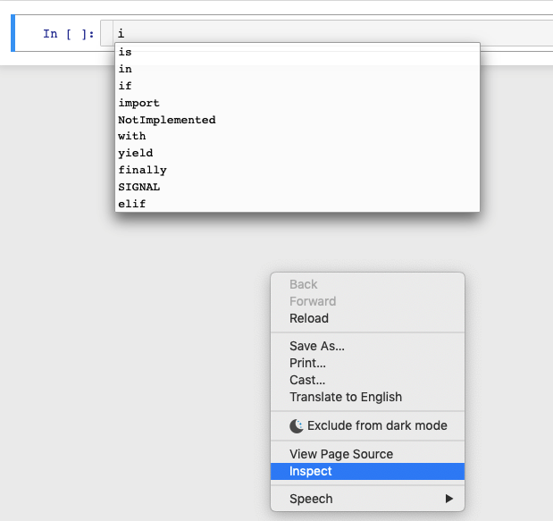
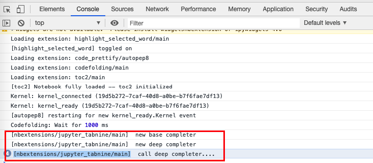

# How To Debug

A lot of users release issues reporting problems with the autofill proposition, here's some steps to get more information about what's wrong.

* Open Chrome Inspect

    

* Open the console and see the logs( All logs of this plugin start with `[nbextensions/jupyter_tabnine/main]` )

    

* If you can't figure out what's wrong, please do not hesitate to release an issue and report the detail of logs in that issue.
